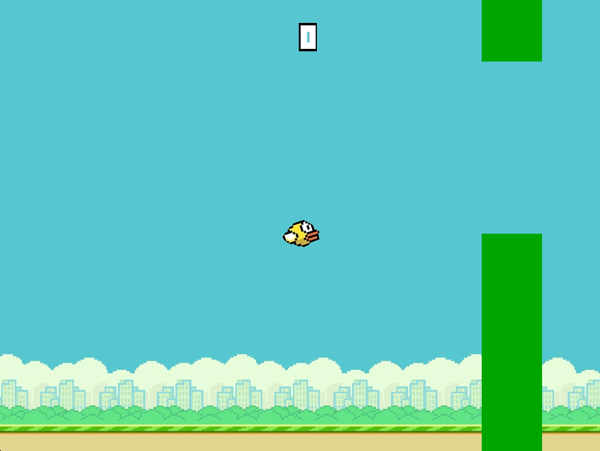
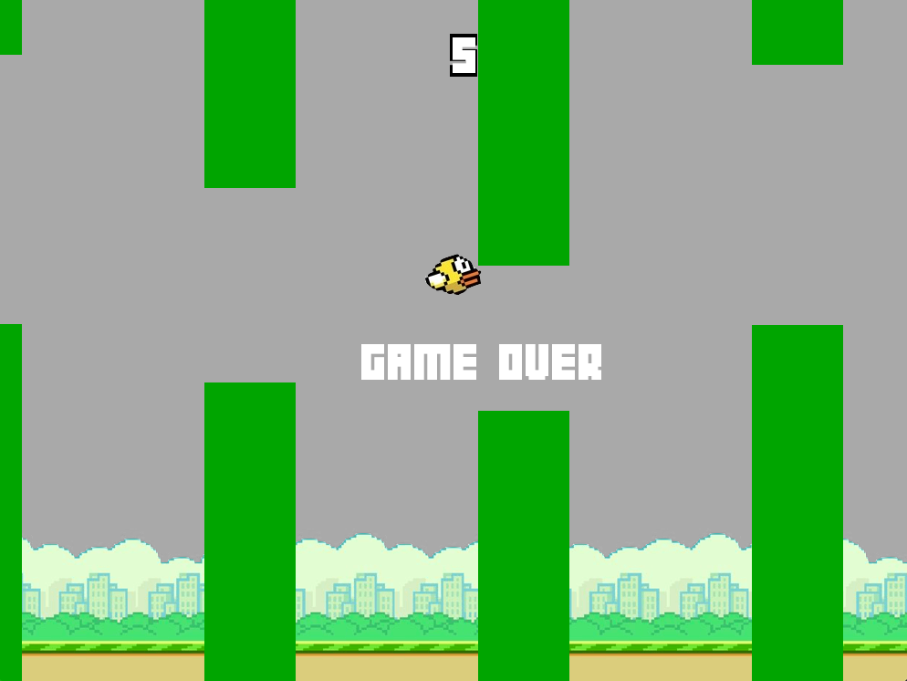

# c++ flappybird

### final project for cs 211 by claire lu and isabel zhong

#### rules:
1. The bird is initially placed in the center of the screen.
2. The player can begin the game by pressing the spacebar.
3. Pressing the spacebar after the game starts will make the bird “jump” or move up on the screen. Otherwise, the bird will fall downwards towards the ground.
4. If the player hits an obstacle or the ground, the game ends.
5. When the player passes through all obstacles (some set number of them), the game ends.
6. If the player passes through an obstacle, the player gains a point.
7. An ongoing scoreboard will keep track of and show the gained points.
8. The obstacles protruding from the top and bottom of the screen will move from right to left on the screen.
9. The obstacles will be at random heights.
10. The gaps between the obstacles (the holes the player jumps through) will be of random size.

  
   

